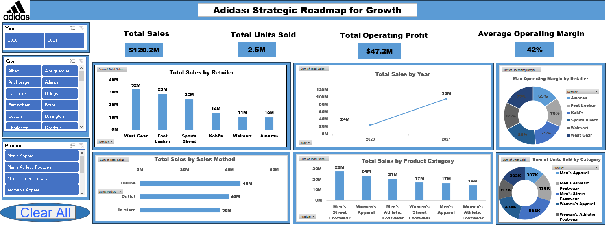
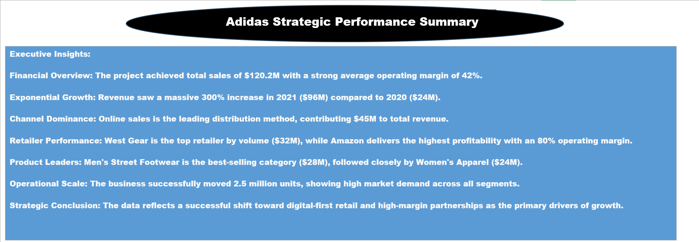

# Adidas Strategic Roadmap for Growth Dashboard

## Dashboard Overviews

## Project Overview
This project presents an interactive dashboard analyzing Adidas sales performance across multiple dimensions including time, retailers, sales channels, product categories, and geography. 
The dashboard supports data-driven decision-making by providing clear insights into revenue growth, profitability, and customer demand.

---

## Key Performance Indicators (KPIs)
* **Total Sales:** $120.2M
* **Total Units Sold:** 2.5M
* **Total Operating Profit:** $47.2M
* **Average Operating Margin:** 42%

---

## Sales Analysis

### Sales by Retailer
* **West Gear:** $32M
* **Foot Locker:** $29M
* **Sports Direct:** $25M
* **Kohl’s:** $14M
* **Walmart:** $11M
* **Amazon:** $10M

### Operating Margin by Retailer
* Highest operating margin achieved by **West Gear (80%)**, indicating strong profitability among key retail partners.

---

## Sales Trends Over Time
* Sales increased significantly from **$24M in 2020** to **$96M in 2021**, reflecting strong business growth and market recovery.

---

## Sales Channels Performance
* **Online:** $45M
* **Outlet:** $40M
* **In-store:** $36M
* *Online sales represent the highest-performing sales channel.*

---

## Product Performance

### Sales by Product Category
* **Men’s Street Footwear:** $28M
* **Women’s Apparel:** $24M
* **Men’s Athletic Footwear:** $21M
* **Women’s Street Footwear:** $17M
* **Men’s Apparel:** $17M
* **Women’s Athletic Footwear:** $14M

### Units Sold by Category
* Highest units sold recorded in **Men’s Athletic Footwear (593K units)**, indicating strong demand.

---

## Tools & Technologies
* **Microsoft Excel**: Pivot Tables, Charts, and Advanced Formulas.
* **Data Visualization**: Interactive Dashboard Design.
* **Business Analysis**: Trend Analysis and Performance Tracking.

---

## Key Insights
* **Online Dominance:** Online sales are the primary growth driver.
* **Top Partner:** West Gear is the most profitable retail partner.
* **Product Focus:** Footwear categories dominate both sales value and volume.
* **Growth:** 2021 shows significant recovery and growth compared to 2020.

---

## Conclusion
This dashboard provides a comprehensive view of Adidas sales and profitability performance and can be used to support strategic planning and business growth decisions.
